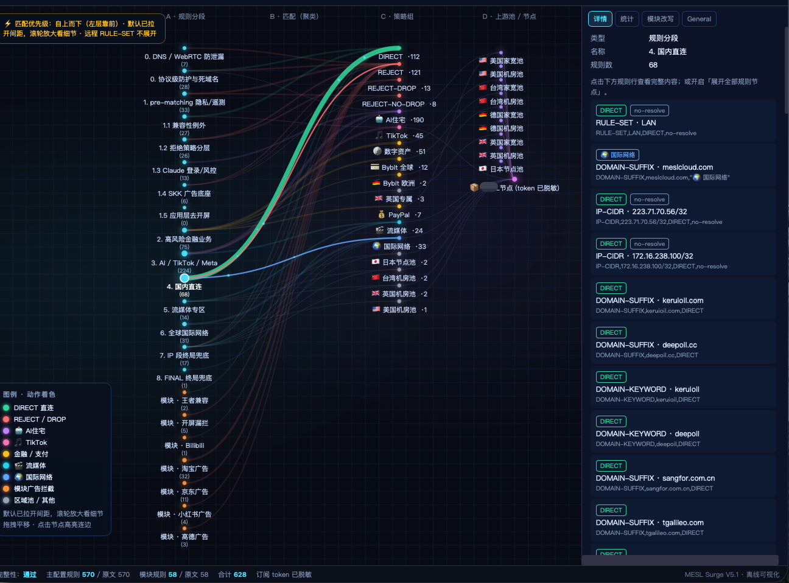

[中文](https://github.com/dalao-all/Surge-Diversion-Rules) | English

# Your Subscription Surge V6.0 — Diversion Rules

I maintain this public **Surge policy / ruleset** repo: owned mirrors, small patches, desensitized share profiles, and a rule-map visualization.  
**This project ships no subscription secrets or nodes.** Technical exchange and personal study only — not a proxy service, and I do not provide access.

- Description page: [`index.html`](./index.html)
- Interactive rule map: [`rule-map.html`](./rule-map.html)
- Rules overview: [`docs/RULES_OVERVIEW.md`](docs/RULES_OVERVIEW.md)
- Getting started: [`docs/GETTING_STARTED.md`](docs/GETTING_STARTED.md)

## Install (share profile)

1. Download [`profiles/Your-Subscription-Surge-V6.0.share.conf`](profiles/Your-Subscription-Surge-V6.0.share.conf) that I provide
2. Download [`profiles/Your-Subscription-AdBlock-V6.0.sgmodule`](profiles/Your-Subscription-AdBlock-V6.0.sgmodule)
3. Open the conf in a text editor and replace  
   `https://subscription.example.invalid/REPLACE_WITH_YOUR_SUBSCRIPTION`  
   with a Surge subscription URL **you** already own; replace `your-subscribe-host.example` if needed
4. Import into Surge and install the module; manually refresh「📦 Your Subscription」

Rules and ad-block scripts point at this project's GitHub raw paths (canonical Chinese repo host for RULE-SET URLs):

| Path | What I put here |
|------|-----------------|
| `mirrors/skk/` | Owned mirror of SKK public lists |
| `mirrors/scripts/` | Owned mirror of AdBlock helper scripts |
| `mirrors/blackmatrix7/` | Historical remote lists (reference) |
| `patches/` | Critical exception patches (AI / finance / DIRECT / ads) |
| `profiles/` | Desensitized share conf + module |
| `docs/` / `scripts/` | Docs and maintenance scripts |

## Rule layers (summary)

Rules match top-down. I split them into four layers — details in [`docs/RULES_OVERVIEW.md`](docs/RULES_OVERVIEW.md):

1. **patches/** — critical front exceptions (before the ad base)
2. **mirrors/skk/** — main diversion + ad / domestic / streaming / global indexes
3. **mirrors/scripts/** — scripts used by the AdBlock module
4. **Inline exceptions in the main conf** — protocol / precise rules that should not live in lists

`rule-map.html` visualizes the same policy-group intent and match order for study.

## Policy-group intent (summary)

| Group | Intent |
|-------|--------|
| 🤖 AI住宅 | Sensitive AI / identity traffic; residential preferred |
| 🎵 TikTok | US datacenter Smart; exclude residential / low-ratio |
| 🪙 / 💳 / 🇩🇪 / 💰 | Digital-asset & payment regional exits |
| 🎬 流媒体 | High-bandwidth Smart |
| 🌍 国际网络 | Chat / general international fallback |
| DIRECT / REJECT* | Domestic direct + ad / leak protection |

## Layout

| Path | Notes |
|------|-------|
| `profiles/*.share.conf` / `*.sgmodule` | Desensitized share profiles I publish |
| `mirrors/` | Owned rule / script mirrors |
| `patches/` | Small auditable patches |
| `docs/` | English getting-started + overview; other maint docs included |
| `scripts/` | Interest-driven sync tools |
| `index.html` / `rule-map.html` / `assets/` | Description page and rule map |

## Updates

I sync upstream changes into `mirrors/` / `patches/` and keep the share conf aligned.  
**I do not commit private profiles that contain real subscriptions.**

> Technical exchange and personal study only. Not a proxy service. No nodes. Follow local law and GitHub terms.
